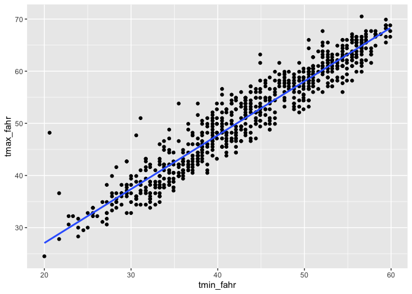
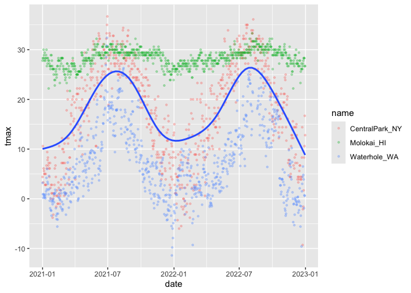
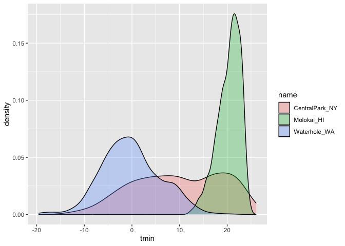
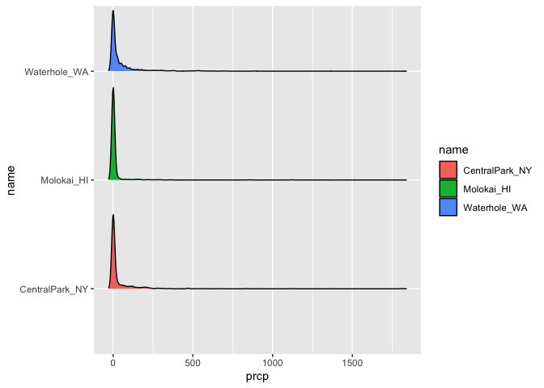
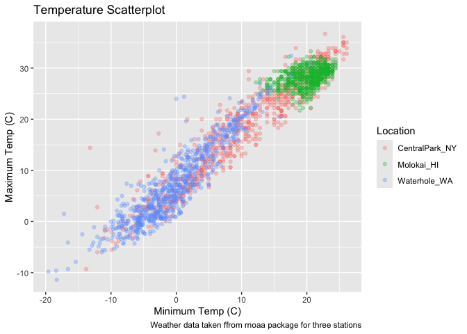
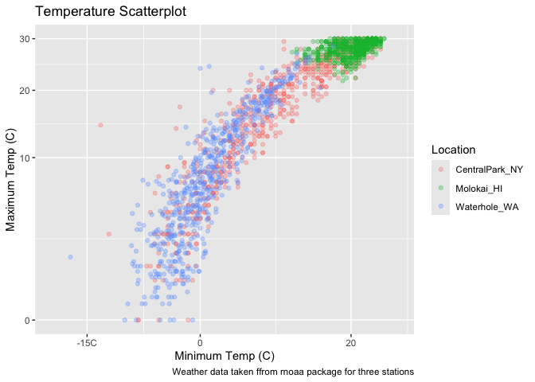
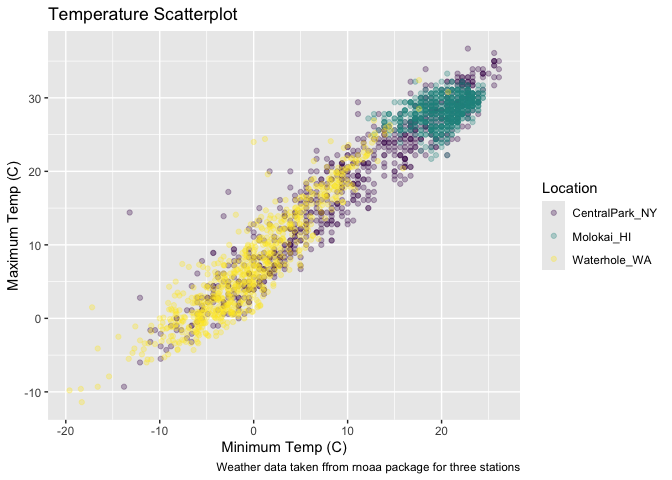

Vis II
================
2024-10-01

``` r
weather_df = 
  rnoaa::meteo_pull_monitors(
    c("USW00094728", "USW00022534", "USS0023B17S"),
    var = c("PRCP", "TMIN", "TMAX"), 
    date_min = "2021-01-01",
    date_max = "2022-12-31") |>
  mutate(
    name = case_match(
      id, 
      "USW00094728" ~ "CentralPark_NY", 
      "USW00022534" ~ "Molokai_HI",
      "USS0023B17S" ~ "Waterhole_WA"),
    tmin = tmin / 10,
    tmax = tmax / 10) |>
  select(name, id, everything())
```

    ## using cached file: /Users/meredithsteinberg/Library/Caches/org.R-project.R/R/rnoaa/noaa_ghcnd/USW00094728.dly

    ## date created (size, mb): 2024-09-26 10:18:43.767423 (8.651)

    ## file min/max dates: 1869-01-01 / 2024-09-30

    ## using cached file: /Users/meredithsteinberg/Library/Caches/org.R-project.R/R/rnoaa/noaa_ghcnd/USW00022534.dly

    ## date created (size, mb): 2024-09-26 10:18:50.009417 (3.932)

    ## file min/max dates: 1949-10-01 / 2024-09-30

    ## using cached file: /Users/meredithsteinberg/Library/Caches/org.R-project.R/R/rnoaa/noaa_ghcnd/USS0023B17S.dly

    ## date created (size, mb): 2024-09-26 10:18:51.846163 (1.036)

    ## file min/max dates: 1999-09-01 / 2024-09-30

Making out first plot :)

``` r
ggplot(weather_df, aes(x = tmin, y = tmax)) +
geom_point()
```

    ## Warning: Removed 17 rows containing missing values or values outside the scale range
    ## (`geom_point()`).

<!-- --> point says
put points for all variables–making a scatterplot for us. aes is our
aesthetics

``` r
weather_df |> 
  ggplot(aes (x =tmin, y=tmax)) + 
  geom_point()
```

    ## Warning: Removed 17 rows containing missing values or values outside the scale range
    ## (`geom_point()`).

<!-- --> can also do
it this way

``` r
ggp_weather_scatterplot=
  weather_df |> 
   ggplot(aes (x =tmin, y=tmax)) + 
  geom_point()

ggp_weather_scatterplot
```

    ## Warning: Removed 17 rows containing missing values or values outside the scale range
    ## (`geom_point()`).

<!-- -->

check why some rows are missing…

``` r
weather_df |> 
  filter(is.na(tmax))
```

    ## # A tibble: 17 × 6
    ##    name         id          date        prcp  tmax  tmin
    ##    <chr>        <chr>       <date>     <dbl> <dbl> <dbl>
    ##  1 Molokai_HI   USW00022534 2022-05-31    NA    NA    NA
    ##  2 Waterhole_WA USS0023B17S 2021-03-09    NA    NA    NA
    ##  3 Waterhole_WA USS0023B17S 2021-12-07    51    NA    NA
    ##  4 Waterhole_WA USS0023B17S 2021-12-31     0    NA    NA
    ##  5 Waterhole_WA USS0023B17S 2022-02-03     0    NA    NA
    ##  6 Waterhole_WA USS0023B17S 2022-08-09    NA    NA    NA
    ##  7 Waterhole_WA USS0023B17S 2022-08-10    NA    NA    NA
    ##  8 Waterhole_WA USS0023B17S 2022-08-11    NA    NA    NA
    ##  9 Waterhole_WA USS0023B17S 2022-08-12    NA    NA    NA
    ## 10 Waterhole_WA USS0023B17S 2022-08-13    NA    NA    NA
    ## 11 Waterhole_WA USS0023B17S 2022-08-14    NA    NA    NA
    ## 12 Waterhole_WA USS0023B17S 2022-08-15    NA    NA    NA
    ## 13 Waterhole_WA USS0023B17S 2022-08-16    NA    NA    NA
    ## 14 Waterhole_WA USS0023B17S 2022-08-17    NA    NA    NA
    ## 15 Waterhole_WA USS0023B17S 2022-08-18    NA    NA    NA
    ## 16 Waterhole_WA USS0023B17S 2022-08-19    NA    NA    NA
    ## 17 Waterhole_WA USS0023B17S 2022-12-31    76    NA    NA

telling us there are 17 rows missing tmax

## Fancier scatterplots!

``` r
weather_df |> 
  ggplot(aes(x=tmin, y=tmax, color=name)) +
  geom_point(alpha=.3, size=.8) + 
  geom_smooth(se = FALSE)
```

    ## `geom_smooth()` using method = 'loess' and formula = 'y ~ x'

    ## Warning: Removed 17 rows containing non-finite outside the scale range
    ## (`stat_smooth()`).

    ## Warning: Removed 17 rows containing missing values or values outside the scale range
    ## (`geom_point()`).

<!-- --> alpha makes
points more transparent

Where you define aesthetics can matter–now putting color=name below and
wont be applied to ggplot

``` r
weather_df |> 
  ggplot(aes(x=tmin, y=tmax)) +
  geom_point(aes(color=name), alpha=.3, size=.8) + 
  geom_smooth(se = FALSE)
```

    ## `geom_smooth()` using method = 'gam' and formula = 'y ~ s(x, bs = "cs")'

    ## Warning: Removed 17 rows containing non-finite outside the scale range
    ## (`stat_smooth()`).

    ## Warning: Removed 17 rows containing missing values or values outside the scale range
    ## (`geom_point()`).

<!-- -->

use faceting real quick

``` r
weather_df |> 
  ggplot(aes(x=tmin, y=tmax, color=name)) +
  geom_point(alpha=.3) +
  geom_smooth(se= FALSE) + 
  facet_grid(. ~ name)
```

    ## `geom_smooth()` using method = 'loess' and formula = 'y ~ x'

    ## Warning: Removed 17 rows containing non-finite outside the scale range
    ## (`stat_smooth()`).

    ## Warning: Removed 17 rows containing missing values or values outside the scale range
    ## (`geom_point()`).

<!-- --> for faced
grid . (nothing) goes in rows and name in columns. can reverse it too

Lets make a somewhat more interesting scatterplot

``` r
weather_df |> 
  ggplot(aes(x=date, y=tmax, color=name, size = prcp)) +
  geom_point(alpha=.3) +
  geom_smooth(se= FALSE) +
  facet_grid(. ~ name)
```

    ## Warning: Using `size` aesthetic for lines was deprecated in ggplot2 3.4.0.
    ## ℹ Please use `linewidth` instead.
    ## This warning is displayed once every 8 hours.
    ## Call `lifecycle::last_lifecycle_warnings()` to see where this warning was
    ## generated.

    ## `geom_smooth()` using method = 'loess' and formula = 'y ~ x'

    ## Warning: Removed 17 rows containing non-finite outside the scale range
    ## (`stat_smooth()`).

    ## Warning: The following aesthetics were dropped during statistical transformation: size.
    ## ℹ This can happen when ggplot fails to infer the correct grouping structure in
    ##   the data.
    ## ℹ Did you forget to specify a `group` aesthetic or to convert a numerical
    ##   variable into a factor?
    ## The following aesthetics were dropped during statistical transformation: size.
    ## ℹ This can happen when ggplot fails to infer the correct grouping structure in
    ##   the data.
    ## ℹ Did you forget to specify a `group` aesthetic or to convert a numerical
    ##   variable into a factor?
    ## The following aesthetics were dropped during statistical transformation: size.
    ## ℹ This can happen when ggplot fails to infer the correct grouping structure in
    ##   the data.
    ## ℹ Did you forget to specify a `group` aesthetic or to convert a numerical
    ##   variable into a factor?

    ## Warning: Removed 19 rows containing missing values or values outside the scale range
    ## (`geom_point()`).

<!-- -->

Learning assessment–need to manipulate data a little bit first

``` r
weather_df |> 
  filter(name == "CentralPark_NY") |> 
  mutate(
    tmax_fahr = tmax + (9/5) + 32,
    tmin_fahr = tmin + (9/5) + 32) |> 
  ggplot(aes(x=tmin_fahr, y=tmax_fahr)) +
  geom_point() +
  geom_smooth(method= "lm", se=FALSE)
```

    ## `geom_smooth()` using formula = 'y ~ x'

<!-- -->

## Small Things

``` r
weather_df |> 
  ggplot(aes(x=date, y=tmax,)) +
  geom_point(aes(color=name), alpha=.3, size=.8) +
  geom_smooth(se= FALSE) 
```

    ## `geom_smooth()` using method = 'gam' and formula = 'y ~ s(x, bs = "cs")'

    ## Warning: Removed 17 rows containing non-finite outside the scale range
    ## (`stat_smooth()`).

    ## Warning: Removed 17 rows containing missing values or values outside the scale range
    ## (`geom_point()`).

<!-- -->

``` r
weather_df |> 
  ggplot(aes(x=tmin, y=tmax)) +
  geom_hex()
```

    ## Warning: Removed 17 rows containing non-finite outside the scale range
    ## (`stat_binhex()`).

<!-- -->

``` r
weather_df |> 
  ggplot(aes(x=tmin, y=tmax)) +
  geom_point(color= "blue")
```

    ## Warning: Removed 17 rows containing missing values or values outside the scale range
    ## (`geom_point()`).

<!-- -->

## Univeriate plots

``` r
weather_df |> 
  ggplot(aes(x=tmin)) + 
  geom_histogram()
```

    ## `stat_bin()` using `bins = 30`. Pick better value with `binwidth`.

    ## Warning: Removed 17 rows containing non-finite outside the scale range
    ## (`stat_bin()`).

<!-- -->

``` r
weather_df |> 
  ggplot(aes(x=tmin, fill=name)) + 
  geom_histogram(position = "dodge")
```

    ## `stat_bin()` using `bins = 30`. Pick better value with `binwidth`.

    ## Warning: Removed 17 rows containing non-finite outside the scale range
    ## (`stat_bin()`).

<!-- --> position
command puts bars next to each other rather than on top of eachother

how would i fix this?

maybe facet?

``` r
weather_df |> 
  ggplot(aes(x=tmin, fill=name)) +
  geom_histogram() +
  facet_grid(. ~ name)
```

    ## `stat_bin()` using `bins = 30`. Pick better value with `binwidth`.

    ## Warning: Removed 17 rows containing non-finite outside the scale range
    ## (`stat_bin()`).

<!-- -->

maybe a density plot?

``` r
weather_df |> 
  ggplot(aes(x=tmin, fill=name)) +
  geom_density(alpha=.3)
```

    ## Warning: Removed 17 rows containing non-finite outside the scale range
    ## (`stat_density()`).

<!-- -->

boxplot

``` r
weather_df |> 
  ggplot(aes(x=name, y=tmin, fill= name)) +
  geom_boxplot()
```

    ## Warning: Removed 17 rows containing non-finite outside the scale range
    ## (`stat_boxplot()`).

<!-- --> fill will
give color to name

violin plots

``` r
weather_df |> 
  ggplot(aes(x=name, y=tmin, fill= name)) +
  geom_violin()
```

    ## Warning: Removed 17 rows containing non-finite outside the scale range
    ## (`stat_ydensity()`).

<!-- -->

ridge plot

``` r
weather_df |> 
  ggplot(aes(x=tmin, y=name)) +
  geom_density_ridges()
```

    ## Picking joint bandwidth of 1.41

    ## Warning: Removed 17 rows containing non-finite outside the scale range
    ## (`stat_density_ridges()`).

<!-- -->

## Learning Assessment

``` r
weather_df |> 
  ggplot(aes(x=prcp, y=name, fill=name)) +
 geom_boxplot()
```

    ## Warning: Removed 15 rows containing non-finite outside the scale range
    ## (`stat_boxplot()`).

<!-- -->

``` r
weather_df |> 
  ggplot(aes(x=prcp, y=name, fill=name)) +
 geom_density_ridges(scale=.85)
```

    ## Picking joint bandwidth of 9.22

    ## Warning: Removed 15 rows containing non-finite outside the scale range
    ## (`stat_density_ridges()`).

<!-- -->

``` r
weather_df |> 
  ggplot(aes(x=name, y=prcp)) + 
  geom_boxplot()
```

    ## Warning: Removed 15 rows containing non-finite outside the scale range
    ## (`stat_boxplot()`).

<!-- -->

``` r
weather_df |> 
  filter(prcp >10, prcp < 1000) |> 
  ggplot(aes(x=prcp, fill=name)) +
  geom_density(alpha=.3)
```

<!-- -->

## Saving and embedding plots

saving plots

``` r
ggp_weather=
weather_df |> 
  ggplot(aes(x= date, y=tmax, color=name)) +
  geom_point()

ggsave("plots/ggp_weather.pdf", ggp_weather, width=8, height=6)
```

    ## Warning: Removed 17 rows containing missing values or values outside the scale range
    ## (`geom_point()`).

embedding plots

``` r
weather_df |> 
  ggplot(aes(x= date, y=tmax, color=name)) +
  geom_point()
```

    ## Warning: Removed 17 rows containing missing values or values outside the scale range
    ## (`geom_point()`).

<!-- -->

Vis II notes start.. Make a scatterplot but fancy this time

``` r
weather_df |> 
  ggplot(aes(x=tmin, y=tmax, color=name)) +
  geom_point(alpha=.3) +
  labs(
    title= "Temperature Scatterplot",
    x= "Minimum Temp (C)",
    y = "Maximum Temp (C)",
    color= "Location",
    caption= "Weather data taken ffrom rnoaa package for three stations"
  )
```

    ## Warning: Removed 17 rows containing missing values or values outside the scale range
    ## (`geom_point()`).

<!-- -->

Scales–start with ‘x’ and ‘y’ and then do ‘color’

``` r
weather_df |> 
  ggplot(aes(x=tmin, y=tmax, color=name)) +
  geom_point(alpha=.3) +
  labs(
    title= "Temperature Scatterplot",
    x= "Minimum Temp (C)",
    y = "Maximum Temp (C)",
    color= "Location",
    caption= "Weather data taken ffrom rnoaa package for three stations"
  ) +
  scale_x_continuous(
    breaks = c(-15, 0, 20),
    labels = c("-15C", "0", "20")
  ) + 
  scale_y_continuous(
    limits = c(0, 30),
    transform = "sqrt"
  )
```

    ## Warning in transformation$transform(x): NaNs produced

    ## Warning in scale_y_continuous(limits = c(0, 30), transform = "sqrt"): sqrt
    ## transformation introduced infinite values.

    ## Warning: Removed 302 rows containing missing values or values outside the scale range
    ## (`geom_point()`).

<!-- -->

Look at color:

``` r
weather_df |> 
  ggplot(aes(x=tmin, y=tmax, color=name)) +
  geom_point(alpha=.3) +
  labs(
    title= "Temperature Scatterplot",
    x= "Minimum Temp (C)",
    y = "Maximum Temp (C)",
    color= "Location",
    caption= "Weather data taken ffrom rnoaa package for three stations"
  ) +
  scale_color_hue(h= c(100,400)) + 
  viridis::scale_color_viridis(discrete = TRUE)
```

    ## Scale for colour is already present.
    ## Adding another scale for colour, which will replace the existing scale.

    ## Warning: Removed 17 rows containing missing values or values outside the scale range
    ## (`geom_point()`).

<!-- -->
